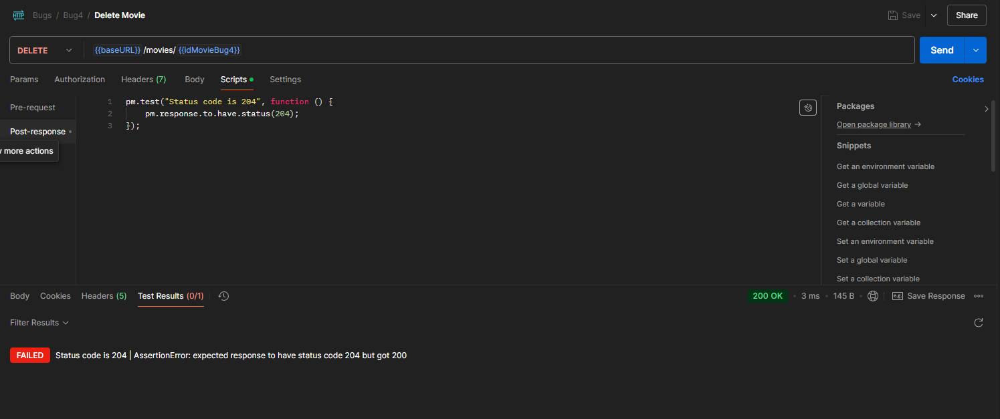

### **Relatório de Execução de Testes - API de Gerenciamento de Filmes**

---

#### **Resumo do Teste**

O teste foi realizado com o objetivo de validar as funcionalidades e desempenho da API de Gerenciamento de Filmes. Foram verificados os requisitos funcionais e não funcionais, destacando problemas identificados e áreas de sucesso.

---

### **Resultados por Funcionalidade**

#### **1. Criando um Novo Filme**

- **Resultado esperado:**

  - Validação de campos obrigatórios e unicidade do título.
  - Retorno do ID do filme com status 201 Created.

- **Problemas encontrados:**

  1. **Autenticação:**  
     A rota `POST /movies` está acessível sem autenticação.

     - **Evidência:**  
       
     - **Reportado:** [bugU.md](./bugs/bugU.md)

  2. **Validação de unicidade do título:**  
     O sistema permite títulos duplicados.

     - **Evidência:**  
         
       
     - **Reportado:** [bugM2.md](./bugs/bugM2.md)

  3. **Retorno do ID:**  
     A API não retorna o ID do filme cadastrado.
     - **Evidência:**  
       
     - **Reportado:** [bugM1.md](./bugs/bugM1.md)

---

#### **2. Obtendo a Lista de Filmes**

- **Resultado esperado:**  
  Retornar todos os filmes cadastrados de forma paginada.

- **Problemas encontrados:**
  - **Paginação:**  
    A API retorna a lista completa de filmes em vez de paginar.
    - **Evidência:**  
      
    - **Reportado:** [bugM4.md](./bugs/bugM4.md)

---

#### **3. Obtendo Detalhes de um Filme por ID**

- **Resultado esperado:**

  - Retornar detalhes do filme existente.
  - Retornar erro 404 Not Found para filmes inexistentes.

- **Resultados:**
  - **Sucesso:**
    - Retorna corretamente os detalhes de um filme.  
      
    - Retorna status 404 para filmes inexistentes.  
      

---

#### **4. Atualizando os Detalhes de um Filme por ID**

- **Resultado esperado:**  
  Atualizar detalhes de um filme com sucesso e retornar status 200 OK.

- **Resultados:**
  - **Sucesso:**  
    Atualização realizada conforme esperado.
    - **Evidência:**  
      

---

#### **5. Excluindo um Filme por ID**

- **Resultado esperado:**  
  Excluir o filme e retornar status 204 No Content.

- **Problemas encontrados:**
  - **Retorno de status:**  
    A API não retorna o status correto após a exclusão.
    - **Evidência:**  
      
    - **Reportado:** [bugM3.md](./bugs/bugM3.md)

---

### **Resultados de Desempenho**

#### **Requisitos Não Funcionais Verificados**

| Requisito                         | Resultado                  | Evidência                                          |
| --------------------------------- | -------------------------- | -------------------------------------------------- |
| **Criação de filmes - 100 req/s** | OK                         |  |
| **GET Listagem - <100ms**         | OK                         |    |
| **GET Detalhes - <50ms**          | OK                         |  |
| **Paginação (20 filmes/página)**  | **Falha** (lista completa) |  |

---

### **Conclusões e Recomendação**

1. **Principais problemas encontrados:**

   - Falha na autenticação em endpoints sensíveis.
   - Ausência de validações de unicidade e ID no retorno.
   - Problemas de paginação e status incorreto em exclusão.

2. **Recomendações:**

   - Implementar autenticação nos endpoints.
   - Corrigir validações de unicidade e retorno de ID.
   - Garantir paginação e status adequados em respostas.

3. **Prioridade de correção:**
   - Alta: Autenticação, validação de unicidade e status de exclusão.
   - Média: Implementação de paginação.

---

**Relatório gerado por:** Gabriel Macedo  
**Data:** 29/11/2024
