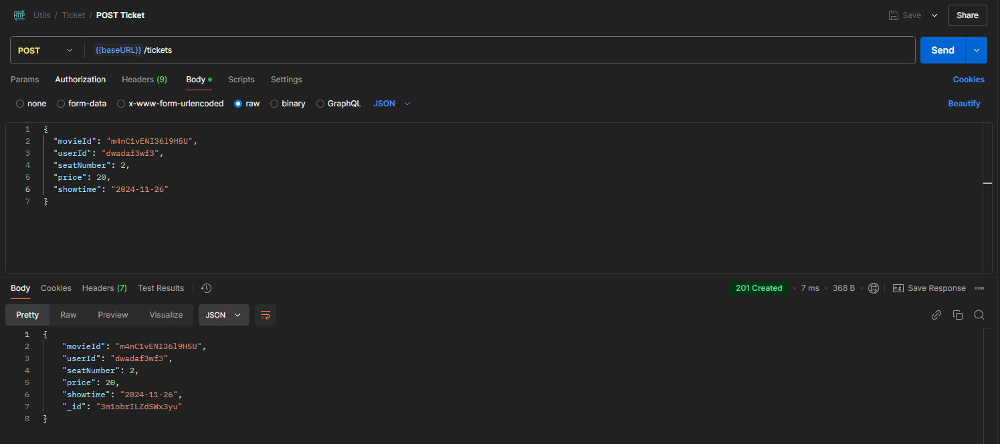
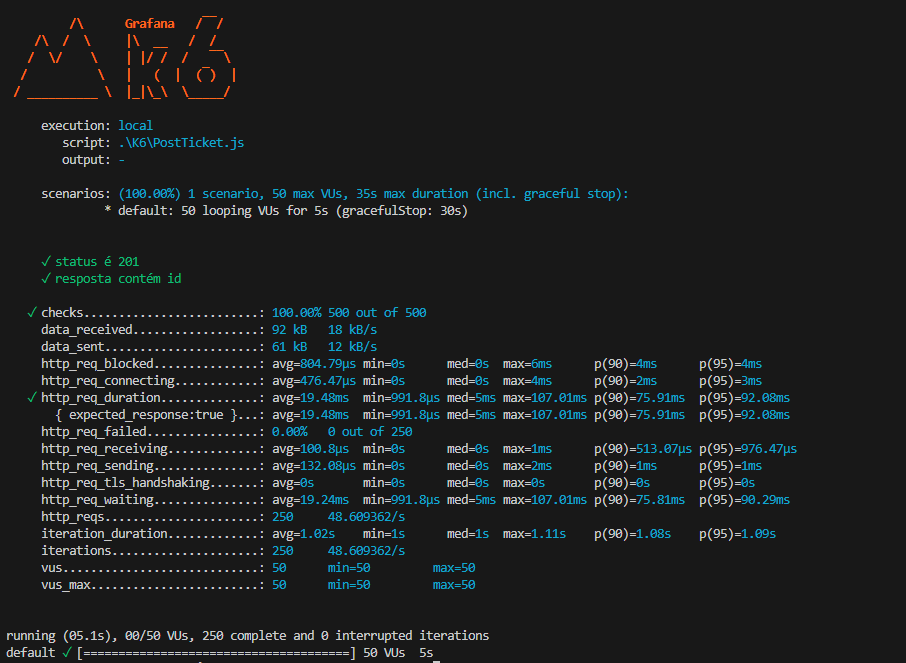

### **Relatório de Execução de Testes - API de Reserva de Ingressos**

#### **Resumo do Teste**

Os testes realizados verificaram os requisitos funcionais e não funcionais da funcionalidade de reserva de ingressos na API. Este relatório destaca os resultados, problemas encontrados e evidências documentadas.

---

### **Resultados por Requisito Funcional**

#### **Solicitação POST para o endpoint `/tickets`**

##### **Campos obrigatórios preenchidos corretamente**

- **Resultado esperado:**  
  Todos os campos obrigatórios devem ser validados.

- **Resultado obtido:**
  - **Sucesso:** O sistema valida corretamente a presença de todos os campos obrigatórios.
  - **Evidência:**  
    

##### **Validação do número do assento (0-99)**

- **Resultado esperado:**  
  Mensagens de erro claras e consistentes com a documentação quando o número do assento é inválido.

- **Problema encontrado:**
  - A mensagem de erro retornada não está em conformidade com a documentação.
  - **Evidência:**  
    
  - **Reportado:** [bugT1.md](./bugs/bugT1.md)

##### **Validação do preço do ingresso (0-60)**

- **Resultado esperado:**  
  Preços fora do intervalo devem ser rejeitados com mensagens de erro apropriadas.

- **Resultado obtido:**
  - **Sucesso:** O sistema valida corretamente os valores de preço.

##### **Criação da reserva de ingresso**

- **Resultado esperado:**

  - Reserva criada com sucesso se todas as validações forem aprovadas.
  - Retorno de um ID único da reserva com status 201 Created.

- **Resultado obtido:**
  - **Sucesso:** Reserva criada com ID único retornado.

---

### **Resultados de Requisitos Não Funcionais**

| Requisito                               | Resultado | Evidência                                                |
| --------------------------------------- | --------- | -------------------------------------------------------- |
| **Capacidade: 50 solicitações/segundo** | OK        |  |
| **Tempo médio de resposta: <300ms**     | OK        |  |

---

### **Conclusões e Recomendações**

#### **Conclusões**

1. **Funcionalidades verificadas:**  
   A funcionalidade de reserva atende aos principais requisitos funcionais, exceto pela inconsistência na mensagem de erro da validação de assentos.

2. **Desempenho:**  
   A API atende aos requisitos de desempenho, processando solicitações no tempo e volume esperados.

#### **Problemas identificados**

- **Inconsistência na mensagem de erro (bugT1):**  
  O feedback para números de assentos inválidos precisa ser ajustado para alinhar-se à documentação oficial.

#### **Recomendações**

1. Corrigir a mensagem de erro na validação do número de assento.
2. Realizar uma revisão geral das mensagens de erro para garantir consistência com a documentação.

---

**Relatório gerado por:** Gabriel Macedo  
**Data:** 29/11/2024
