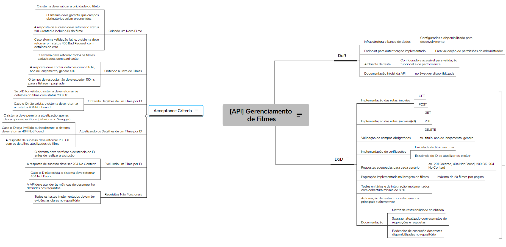

# US 001: Gerenciamento de Filmes na API

## Descrição

**Como** usuário da API de Filmes,  
**Quero** criar, atualizar, deletar, visualizar e buscar filmes,  
**Para** gerenciar o catálogo de filmes de maneira eficiente.

---

## Definition of Ready (DoR)

- Infraestrutura e banco de dados configurados e disponíveis;
- Endpoint de autenticação implementado para validação de permissões de administrador;
- Ambiente de testes funcional configurado para validar as implementações;
- Documentação inicial da API disponível no Swagger.

---

## Definition of Done (DoD)

- Rotas implementadas: `/movies` (GET, POST) e `/movies/{id}` (GET, PUT, DELETE);
- Campos obrigatórios validados (ex.: título, gênero, ano de lançamento);
- Verificação de unicidade do título ao criar um novo filme;
- Verificação da existência do ID ao atualizar ou excluir filmes;
- Retorno de respostas apropriadas para cada cenário (ex.: `201 Created`, `404 Not Found`, `200 OK`, `204 No Content`);
- Paginação na listagem de filmes com limite de 20 itens por página;
- Cobertura de testes unitários e de integração de, no mínimo, 80%;
- Automação de testes cobrindo os fluxos principais e casos alternativos;
- Matriz de rastreabilidade revisada e atualizada;
- Documentação da API no Swagger com exemplos de uso e respostas atualizada;
- Evidências de execução dos testes anexadas no repositório.

---

## Acceptance Criteria

### Criar um Novo Filme:

- O sistema deve validar a unicidade do título antes de criar o registro;
- Campos obrigatórios devem ser preenchidos corretamente;
- A resposta de sucesso deve incluir o status `201 Created` e retornar o ID do filme criado;
- Caso alguma validação falhe, a resposta deve ser um status `400 Bad Request` com detalhes do erro.

### Listar Filmes:

- O sistema deve retornar a lista de filmes cadastrados com paginação;
- Os detalhes de cada filme, como título, ano de lançamento, gênero e ID, devem estar presentes;
- O tempo de resposta para listagens não deve ultrapassar 100ms.

### Obter Detalhes de um Filme por ID:

- O sistema deve retornar os detalhes do filme quando o ID informado for válido, com status `200 OK`;
- Caso o ID não seja encontrado, a resposta deve ser um status `404 Not Found`.

### Atualizar um Filme por ID:

- Apenas campos específicos devem ser atualizáveis, conforme definido no Swagger;
- Caso o ID seja inválido ou não encontrado, o sistema deve retornar `404 Not Found`;
- A resposta de sucesso deve conter o status `200 OK` e os dados atualizados do filme.

### Excluir um Filme por ID:

- Antes de realizar a exclusão, o sistema deve verificar se o ID informado existe;
- Em caso de sucesso, a resposta deve retornar o status `204 No Content`;
- Se o ID não for encontrado, a resposta deve ser um status `404 Not Found`.

---

## Requisitos Não Funcionais

- A API deve atender às métricas de desempenho estabelecidas nos requisitos iniciais;
- Evidências dos testes executados devem ser documentadas no repositório para consulta.
