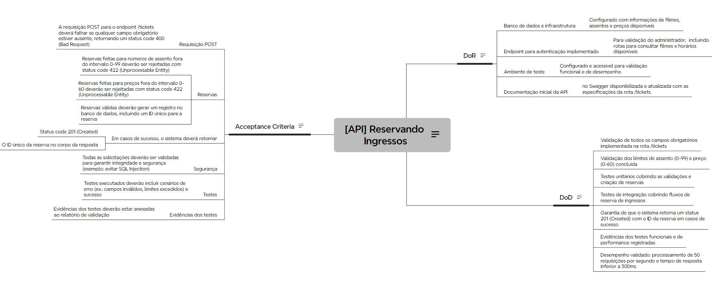

# User Story: Reserva de Ingressos na API

## Descrição

**Como** usuário da API de Ingressos,  
**Eu desejo** reservar ingressos para assistir a um filme no cinema,  
**Para** que eu possa garantir meu lugar no evento desejado.

---

## Definition of Ready (DoR)

- Banco de dados configurado com informações de filmes, assentos e preços disponíveis;
- Endpoints básicos da API implementados, incluindo rotas para consultar filmes e horários disponíveis;
- Ambiente de testes configurado e funcional para validações de desempenho e funcionalidades;
- Documentação da API atualizada com as especificações do endpoint `/tickets`.

---

## Definition of Done (DoD)

- Validação de todos os campos obrigatórios realizada no endpoint `/tickets`;
- Verificação dos limites de assento (0-99) e preço (0-60) implementada;
- Testes unitários cobrindo validações e a criação de reservas concluídos;
- Testes de integração verificando os fluxos de reserva finalizados;
- Garantia de retorno do status `201 Created` com o ID da reserva em casos de sucesso;
- Evidências documentadas dos testes funcionais e de performance;
- Validação de desempenho confirmando capacidade de processar 50 requisições por segundo, com tempo de resposta inferior a 300ms.

---

## Acceptance Criteria

### Requisitos Gerais

- A requisição `POST` no endpoint `/tickets` deve falhar caso algum campo obrigatório esteja ausente, retornando status `400 Bad Request`;
- Reservas com números de assento fora do intervalo 0-99 devem ser rejeitadas;
- Reservas com preços fora do intervalo 0-60 devem ser rejeitadas;
- Reservas válidas devem gerar um registro no banco de dados, incluindo um ID único;
- Em casos de sucesso, o sistema deve retornar:
  - Status `201 Created`;
  - O ID exclusivo da reserva no corpo da resposta.

### Validações e Segurança

- Todas as solicitações devem passar por validações para assegurar integridade e segurança (ex.: proteção contra SQL Injection);
- Testes devem incluir cenários de erro (ex.: campos inválidos ou limites excedidos) e sucesso;
- Relatórios de validação devem conter evidências dos testes executados.
