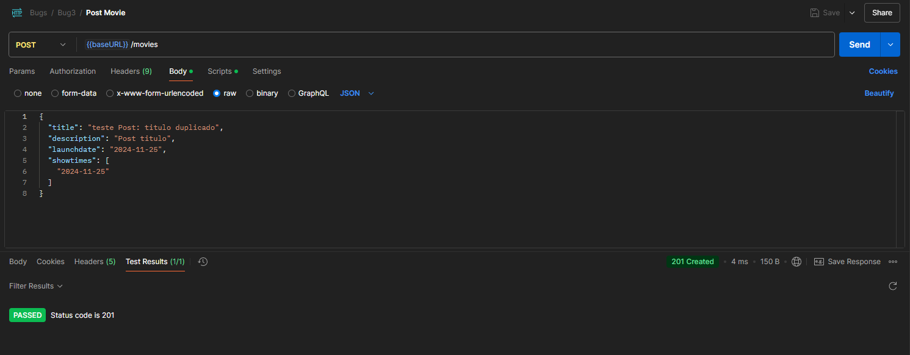

Bug M2: POST Movie Não Valida Unicidade do Titulo do Filme

# Relatório de Bug

## POST Movie Não Valida Unicidade do Titulo do Filme

**Descrição Breve:**  
A API permite cadastrar filmes com Titulos duplicados, o que pode causar inconsistências nos dados.

**Gravidade:**  
Alto

**Prioridade:**  
Alta

**Classificação:**  
DESENVOLVIMENTO

**Passos para Reproduzir:**

1. Enviar uma requisição POST para a rota `/movies` com o Titulo de um filme já cadastrado.
2. Verificar a resposta da API.

**Comportamento Esperado:**  
A API deveria retornar uma mensagem de erro indicando que o Titulo do filme já foi cadastrado.

**Comportamento Observado:**  
A API aceita Titulos duplicados sem validação.

**Ambiente de Teste:**

- **Versão do Software:** 0.0.1

**Anexos:**

- **Capturas de Tela:**

    

    

**Mensagens de Erro ou Logs:**  
Não aplicável.

**Sugestão de Solução (Opcional):**  
Implementar uma validação para impedir a duplicação de Titulos de filmes.

**Observações Finais:**  
Essa falha pode gerar inconsistências e redundâncias nos dados.
