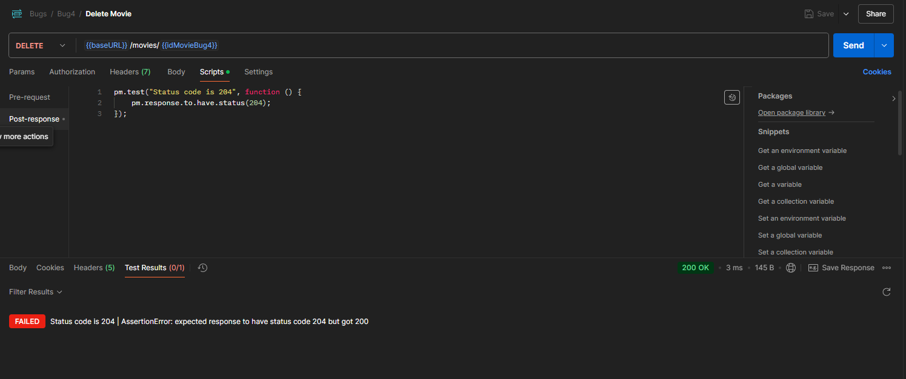

Bug M3: DELETE Movie Retorna Código 200 em Sucesso

# Relatório de Bug

## DELETE Movie Retorna Código 200 em Sucesso

**Descrição Breve:**  
A rota DELETE para filmes retorna o código HTTP 200 em vez do esperado 204.

**Gravidade:**  
Médio

**Prioridade:**  
Média

**Classificação:**  
DESENVOLVIMENTO

**Passos para Reproduzir:**

1. Enviar uma requisição DELETE para a rota `/movies` com um ID válido de filme.
2. Verificar o código de status da resposta.

**Comportamento Esperado:**  
A API deveria retornar o código HTTP 204 para indicar sucesso na exclusão sem conteúdo.

**Comportamento Observado:**  
A API retorna o código HTTP 200.

**Ambiente de Teste:**

- **Versão do Software:** 0.0.1

**Anexos:**

- **Capturas de Tela:**
  

    

**Mensagens de Erro ou Logs:**  
Não aplicável.

**Sugestão de Solução (Opcional):**  
Alterar o código de status retornado de 200 para 204.

**Observações Finais:**  
Embora funcionalmente correto, o código retornado não está de acordo com as práticas recomendadas de APIs REST.
