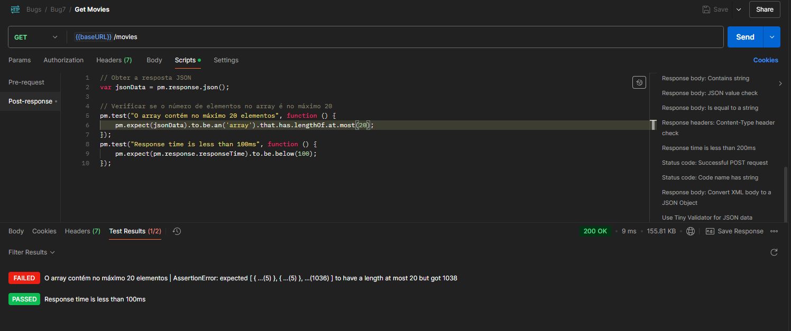

Bug M4: GET movies não retorna paginação correta com 20 filmes por página

# Relatório de Bug

## GET movies não retorna paginação correta com 20 filmes por página

**Descrição Breve:**  
A rota `GET /movies` não implementa a paginação corretamente, retornando todos os filmes, desconsiderando o limite de 20 itens por página conforme os critérios de aceitação.

**Gravidade:**  
Médio

**Prioridade:**  
Média

**Classificação:**  
DESENVOLVIMENTO

**Passos para Reproduzir:**

1. Enviar uma requisição GET para a rota `/movies` sem parâmetros adicionais.
2. Verificar a resposta e notar que o número de filmes retornados excede ou não atinge o limite de 20 filmes por página.
3. Repetir o processo adicionando parâmetros de paginação explícitos e observar se o comportamento é inconsistente.

**Comportamento Esperado:**  
A API deveria retornar no máximo 20 filmes por página. Caso existam mais de 20 filmes, os resultados deveriam ser divididos entre as páginas subsequentes.

**Comportamento Observado:**  
A rota `GET /movies` retorna todos os filmes em uma única resposta, ignorando o limite de 20 filmes por página.

**Ambiente de Teste:**

- **Versão do Software:** 0.0.1

**Mensagens de Erro ou Logs:**  
Nenhuma mensagem de erro é exibida, mas os resultados retornados não estão de acordo com os critérios de aceitação.

**Anexos:**

- **Capturas de Tela:**
  

    

**Sugestão de Solução (Opcional):**  
Revisar a lógica de paginação no backend para garantir que a API respeite o limite máximo de 20 filmes por página.

**Observações Finais:**  
Embora não seja um problema crítico, a inconsistência na paginação pode impactar a usabilidade do sistema, especialmente para aplicações que dependem de um consumo previsível de dados da API.
